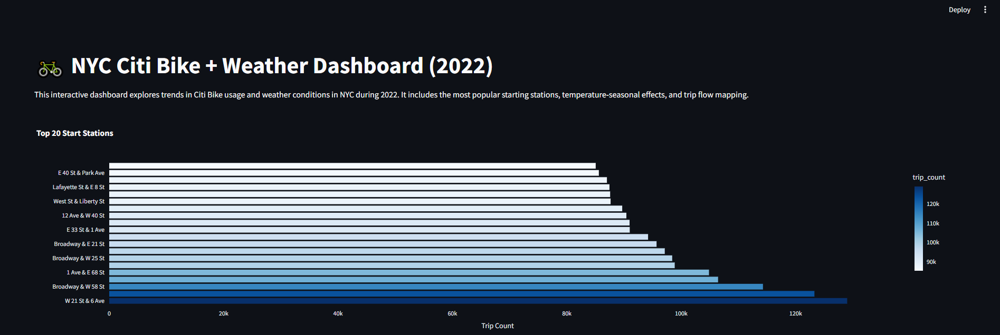
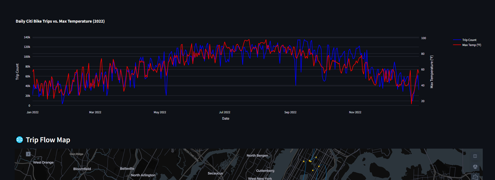
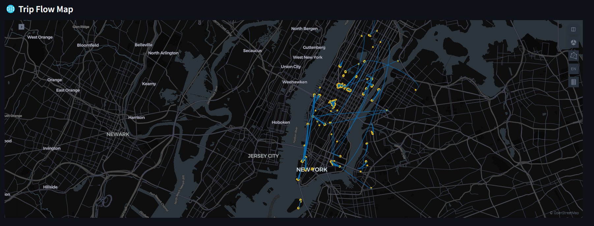

# 🚲 NYC Citi Bike Dashboard

This Streamlit dashboard provides an in-depth analysis of 2022 Citi Bike usage in New York City, using a public trip dataset enriched with weather indicators.

## 🎯 Objective

To provide the NYC strategy team with **actionable insights** on:

- Seasonal demand patterns and weather correlation.
- High-traffic station hubs needing operational focus.
- Commuter behaviors based on hourly usage.
- The most significant trip flows across the city.
- Data-driven recommendations for fleet management and rebalancing.

## 🧪 Dataset

- `citibike_final_sample.csv`: A 25,000-trip random sample from the original 2022 dataset. This smaller file ensures fast performance and is suitable for web deployment.
- Weather data (`TMAX`) was merged with trip start timestamps to analyze correlations.

## 📊 Features

| Page                       | Description                                                              |
| -------------------------- | ------------------------------------------------------------------------ |
| **Introduction** | Overview of project goals and dashboard navigation.                      |
| **Daily Trends & Weather** | Dual-axis line chart comparing trip count with max daily temperature.    |
| **Popular Stations** | Horizontal bar chart of the top 20 busiest start stations.               |
| **Trip Flow Map** | Kepler.gl interactive map visualizing the top 75 trip-flow arcs.         |
| **Hourly Usage** | Bar chart breaking down trip volume by hour of the day.                  |
| **Recommendations** | Key takeaways and operational suggestions for the strategy team.         |

## 📸 Screenshots





## 🌐 Live Dashboard

▶️ **View the deployed dashboard here: [Your Streamlit App URL]** ## ⚙️ Setup & Installation

Create a virtual environment and install the required packages.

```bash
pip install -r requirements.txt
````

To run the app locally:

```bash
streamlit run software/Citibike_dashboard_final.py
```

## 📁 File Structure

```
.
├── .devcontainer/
├── documentation/
├── notebooks/
├── screenshots/
│   ├── dashboard_screenshot_1.PNG
│   └── dashboard_screenshot_2.PNG
├── software/
│   ├── Citibike_dashboard_final.py
│   ├── citibike_arc_map_base.html
│   └── citibike_final_sample.csv
├── README.md
└── requirements.txt
```
